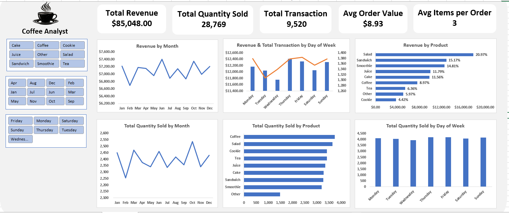
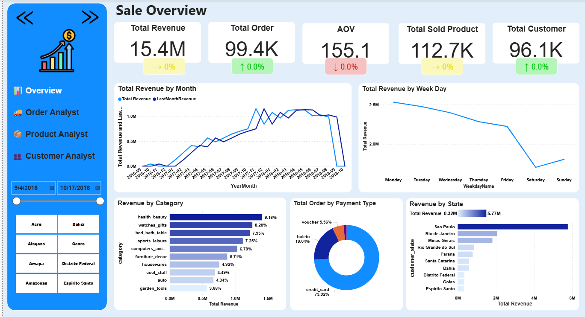
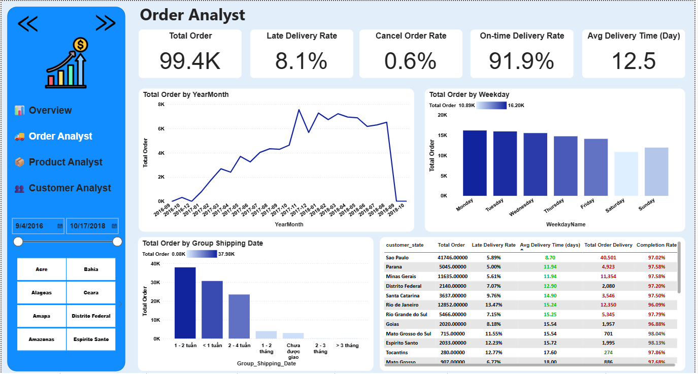
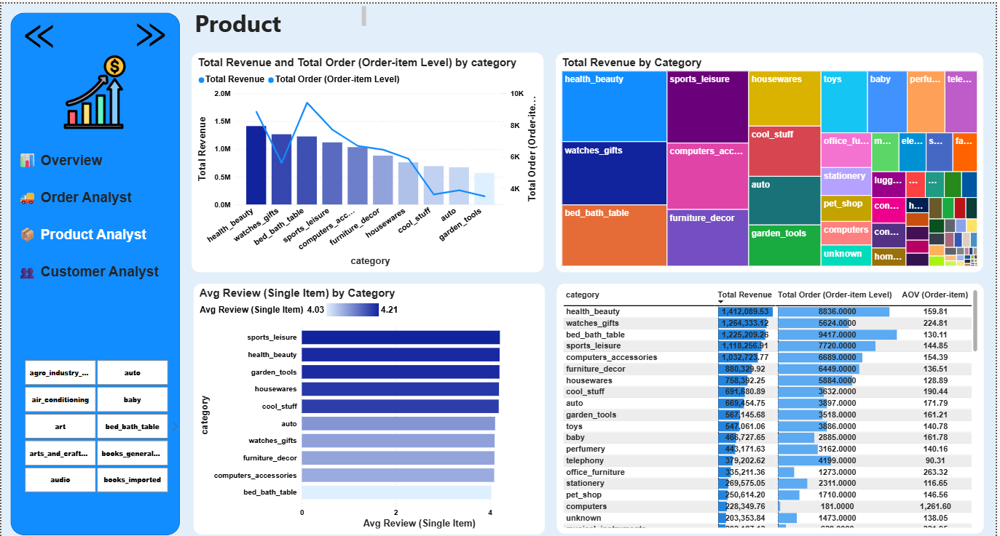
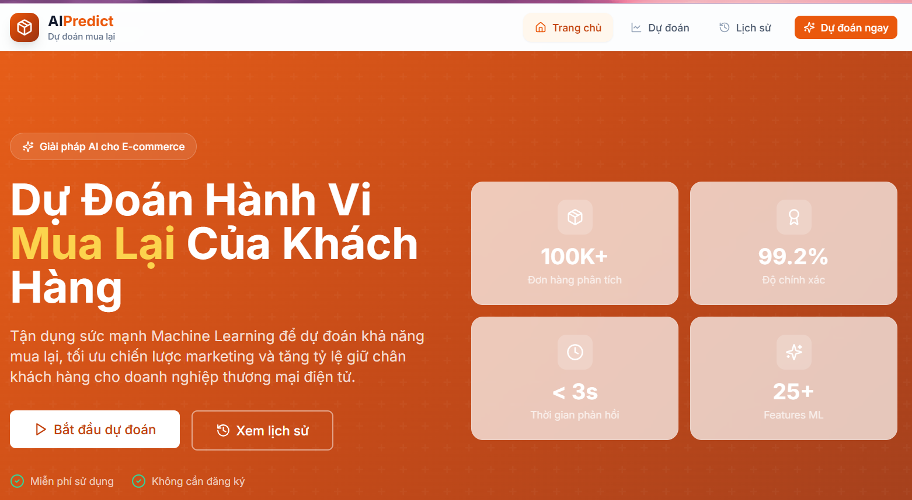
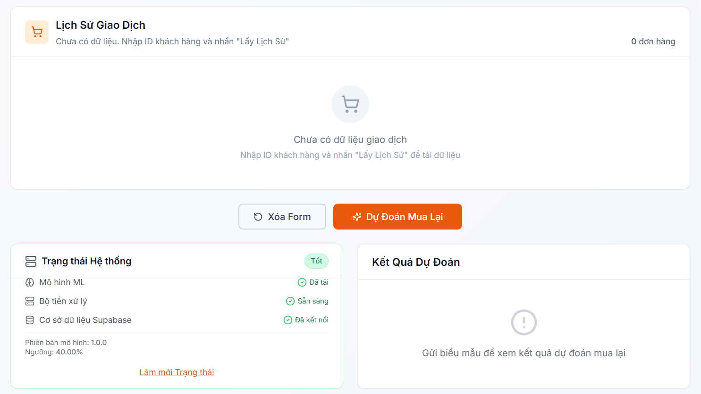

# About me

  I am a final-year Computer Science student seeking a Data Analyst Intern position, with strong skills in SQL, Python, and Excel.
    
  I have hands-on experience in data cleaning, exploratory data analysis, and building dashboards to transform raw data into actionable insights. I am particularly interested in analyzing trends, supporting business decisions, and presenting results in a clear and structured way.
    
  In the long term, I aim to become a Senior Data Analyst, specializing in forecasting models and data-driven optimization of business performance.
  

# Portfolio
---
## *"Coffee Shop Sales Analysis"* | Excel  

**_Key Skills:** Microsoft Excel, Power Query, Pivot Tables, Dashboard Design, Data Cleaning_

Business performance analysis of a coffee shop using <b>9,521 transactions</b>, leveraging Excel and Power Query for data cleaning, multi-dimensional Pivot Table analysis, and interactive Dashboard creation.
  
<b>Problem Statement:</b>
<ul>
<li>Understand revenue trends over time (monthly and weekday patterns)</li>
<li>Identify top revenue-generating vs. top-selling products</li>
<li>Explore opportunities to increase Average Order Value (AOV)</li>
<li>Develop more effective product and pricing strategies</li>
</ul>
<b>Dataset:</b> 10,000 raw transactions with quality issues (ERROR, UNKNOWN, null values) → 9,521 valid records after cleaning.
  
<b>Cleaning Process (Power Query):</b>
<ul>
<li>Handle null values: Price Per Unit → replace with median; Quantity → calculate from Total Spent/Price</li>
<li>Infer missing values: Item lookup from price; Location → "Unknown"; Payment → "Other"</li>
<li>Remove Transaction Date null rows to ensure accurate time-series analysis</li>
</ul>
<b>Approach:</b>
<ul>
<li><b>Exploratory Analysis:</b> Pivot Tables aggregating revenue, order count, and product quantity by month and day of week</li>
<li><b>Product Analysis:</b> Ranking products by revenue and sales volume</li>
<li><b>AOV Analysis:</b> Calculating Average Order Value and average items per order</li>
<li><b>Visualization:</b> Interactive Excel Dashboard with KPI cards, time series charts, and product performance charts</li>
</ul>
<b>Key Insights:</b>
<ul>
<li><b>Product-Performance Gap:</b> Best-selling products by volume do not always generate highest revenue → Opportunity to adjust product mix</li>
<li><b>Revenue Distribution:</b> Some products have high volume but low revenue contribution → Pricing or upsell opportunities</li>
<li><b>Stable Demand:</b> Revenue remains stable over time without clear peak hours → Potential to exploit high-demand periods</li>
<li><b>AOV Opportunities:</b> Bundling and upselling strategies can increase average revenue per order</li>
</ul>

 

 

---
## *"Olist E-commerce Data Analysis"* | SQL Server & Power BI  

**_Key Skills:** SQL Server, Power BI, DAX, Data Modeling, Star Schema, Dashboard Design_

Built a comprehensive <b>Business Intelligence Dashboard</b> for <b>Olist E-commerce platform (Brazil)</b>, simulating the complete workflow of a Data Analyst / BI Developer from raw data processing to visualization and insight extraction.
  
<b>Problem Statement:</b>
<ul>
<li>Revenue overview and growth trends over time</li>
<li>Delivery performance and late delivery rate by state</li>
<li>Product category analysis using Pareto principle (80/20)</li>
<li>Customer segmentation based on spending behavior</li>
</ul>
<b>Dataset:</b> 9 tables including Customers, Sellers, Orders, Order Items, Payments, Reviews, Products, Product Category Translation, Geolocation.
  
<b>Data Processing (SQL Server):</b>
<ul>
<li>Data Cleaning: Handle null values, remove erroneous data</li>
<li>Normalization: Standardize State → Full Name</li>
<li>Feature Engineering: Create delivery_days, revenue, is_late_delivery</li>
<li>Time Modeling: Build dim_date table for time-series analysis</li>
</ul>
<b>Data Modeling (Power BI):</b>
<ul>
<li>Designed <b>Star Schema</b> with 1-to-many relationships between Dimension and Fact tables</li>
<li>Fact tables: fact_order_item, fact_order, fact_review</li>
<li>Dimension tables: dim_product, dim_customer, dim_seller, dim_date</li>
<li>Granularity at order_item_id level for drill-down from overview to specific products</li>
</ul>
<b>DAX Measures:</b>
<ul>
<li>Financial metrics: Total Revenue, AOV, Total Orders, Total Customers</li>
<li>Cancellation rate, Late delivery rate</li>
<li>Time Intelligence: Year-over-year comparison, monthly growth rate</li>
<li>"Pure" Review Score using CALCULATE, FILTER, VALUES (Single Item Orders only)</li>
</ul>
<b>Dashboard includes 4 pages:</b>
<ul>
<li><b>Overview Analyst:</b> Revenue overview, growth trends, geographic distribution</li>
<li><b>Order & Delivery Analyst:</b> Delivery performance, late delivery rate by state</li>
<li><b>Product Analyst:</b> Pareto analysis, "Star" products (High revenue + Good reviews), high-potential segments</li>
<li><b>Customer Analyst:</b> Customer segmentation by spending and frequency, retention strategies</li>
</ul>
<b>Key Insights:</b>
<ul>
<li>Identified revenue explosion points by time cycle and key markets</li>
<li>Recognized bottlenecks in the final-mile supply chain</li>
<li>Classified core product categories using 80/20 rule, identified quality-risk products</li>
<li>Differentiated behavior between "High-value" customers vs. loyal low-AOV customers</li>
</ul>

 
<h3>Overview:</h3>

 

<h3>Order Analyst</h3>

 

<h3>Product Analyst:</h3>

 

<h3>Customer Analyst:</h3>

 

---
## *"Customer Repurchase Prediction"* | Python & Machine Learning  

**_Key Skills:** Python, XGBoost, Feature Engineering, FastAPI, Next.js, PostgreSQL, MLOps_

Developed a Machine Learning model to predict customer repurchase likelihood in the following month, combined with fullstack web app deployment (FastAPI + Next.js + PostgreSQL) and a 3-segment customer strategy to optimize marketing budget allocation.
  
<b>Problem Statement:</b>
<ul>
<li>Identify customers with medium repurchase likelihood for targeted marketing investment</li>
<li>Avoid wasting budget on customers who will return organically or have already churned</li>
<li>Accelerate conversion of customers at the decision threshold</li>
</ul>
<b>Dataset:</b> Online Retail II from Kaggle with <b>1,067,371 transactions</b> (2009-2011), ~794K transactions after cleaning.
  
<b>Data Preparation:</b>
<ul>
<li>Format standardization: Customer ID → string, InvoiceDate → datetime</li>
<li>Canceled order detection (is_canceled) based on invoice code containing 'C' or Quantity < 0</li>
<li>Product categorization into 11 groups</li>
<li>Calculate valid spending: valid_spend = Quantity × unit_price</li>
</ul>
<b>Snapshot Dataset (Rolling Window):</b>
<ul>
<li><b>Observation Window (5 months):</b> Calculate customer behavioral features</li>
<li><b>Performance Window (1 month):</b> Determine target variable (repurchase or not)</li>
<li>Only consider customers with >2 months continuous activity in past 5 months</li>
</ul>
<b>Feature Engineering (51 → 23 features):</b>
<ul>
<li>Feature structure: {Metric}_{Feature}_{TimeFrame}</li>
<li>Filter high-correlation variables (>90%) using Random Forest</li>
<li>Evaluate non-linear relationships using Mutual Information, remove 25% lowest MI variables</li>
<li>Retain core variables: recency_days, tenure_days, active_months_L5M, cancel_rate_L5M, avg_gap_L5M</li>
</ul>
<b>Model Training (XGBoost):</b>
<ul>
<li>Time-based split: 80% train / 20% test following chronological order</li>
<li>Class weighting to handle data imbalance</li>
<li>Hyperparameter tuning: HalvingGridSearchCV + GridSearchCV + Early Stopping</li>
<li>Threshold tuning from 0.3 to 0.9, selected optimal threshold 0.4</li>
<li><b>Results:</b> Recall 0.83, F1 0.6781</li>
</ul>
<b>3-Segment Customer Strategy:</b>
<ul>
<li><b>🔥 Hot Group (Prob ≥ 0.60):</b> ~15-20% customers - Self-returning, light email, low cost (5-10K/customer)</li>
<li><b>🌤️ Warm Group (Prob 0.40-0.60):</b> ~30-35% customers - Primary target group, 20-30% vouchers, high cost (50-100K/customer)</li>
<li><b>❄️ Cold Group (Prob < 0.40):</b> ~45-50% customers - No offers, newsletter only, very low cost (0-5K/customer)</li>
</ul>
<b>Fullstack Architecture:</b>
<ul>
<li><b>Frontend:</b> Next.js (deployed on Vercel)</li>
<li><b>Backend:</b> FastAPI + XGBoost model (deployed on Render)</li>
<li><b>Database:</b> PostgreSQL (Supabase)</li>
<li>REST API endpoints: /predict, /health, /applications</li>
<li>Store prediction history in database</li>
</ul>

<h3>Home page:</h3>

 

<h3>Predict page:</h3>

 

 

<h3>History page:</h3>

 
